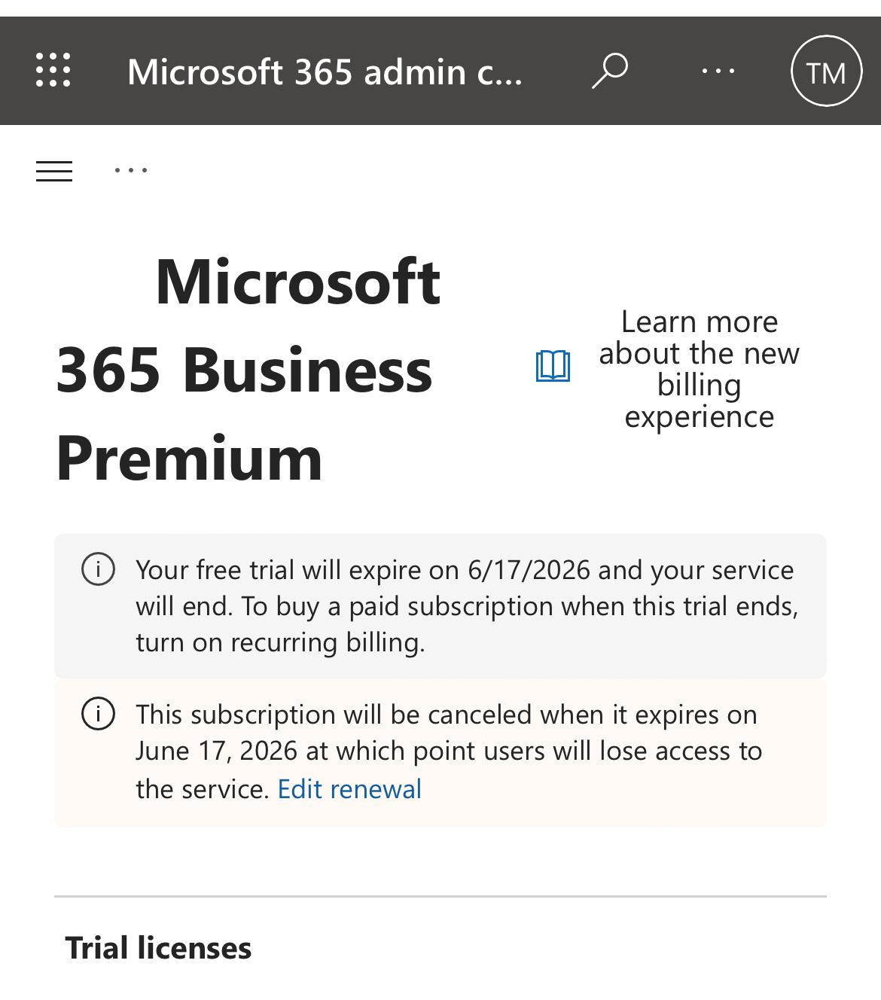
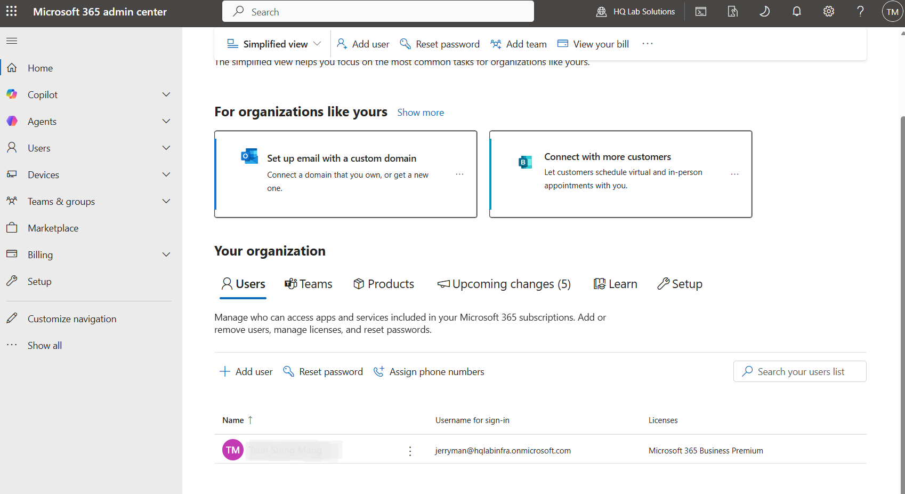
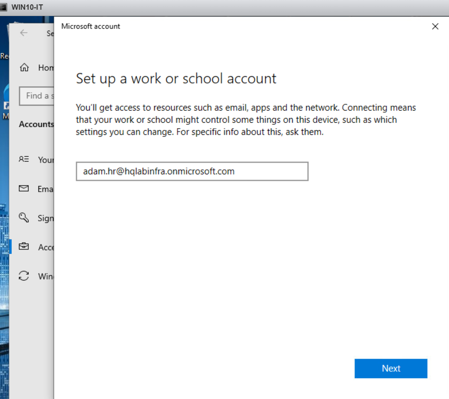
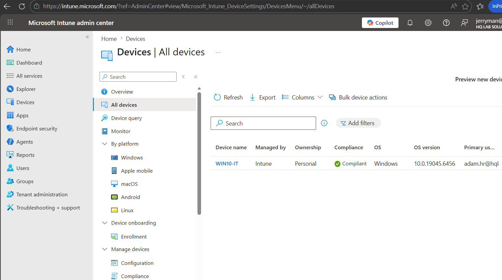

# Microsoft Intune & Cloud Endpoint Management Lab

## Overview

This project focused on learning Microsoft Intune, Microsoft Entra ID, and modern cloud-based endpoint management technologies.

The objective was to understand how organisations centrally manage users, devices, compliance policies, configuration profiles, and application deployment through Microsoft cloud services.

The lab environment was integrated with an existing on-premises Active Directory infrastructure and VMware ESXi environment, providing practical experience with both traditional and cloud-based management approaches.

## Architecture Diagram

```text
Dell T110 II
     │
VMware ESXi
     │
 ├─ DC1 (Windows Server 2019)
 │      HQ.lab.org
 │
 └─ WIN10-IT
        │
        ├─ Domain Joined
        ├─ Workplace Joined
        └─ Intune Enrolled
```

---

## Objectives

* Configure Microsoft Entra ID users and groups
* Enrol Windows devices into Microsoft Intune
* Configure device compliance policies
* Create and deploy configuration profiles
* Understand cloud-based endpoint management concepts
* Package and deploy Win32 applications using Microsoft Intune
* Troubleshoot application deployment issues
* Compare traditional Active Directory management with modern cloud-native endpoint management

---

## Lab Environment

### Hardware

* Dell PowerEdge T110 II
* VMware ESXi Host

### Virtual Machines

* Windows Server 2019 (Domain Controller)
* Windows 10 Enterprise (WIN10-IT)

### Cloud Services

* Microsoft 365 Business Premium Trial
* Microsoft Entra ID
* Microsoft Intune

### Domain

* HQ.lab.org

### User Accounts

* adam.hr
* rex.finance
* ming.it

---

## Tasks Completed

### Task 1 – Microsoft 365 Tenant Setup

Configured Microsoft 365 tenant environment and explored Microsoft Entra ID administration.


Figure 1. Tenant setup and Microsoft 365 Business Premium activation.

### Task 2 – User and Group Management

Created and managed cloud users and security groups.


Figure 2.1 Microsoft 365 cloud user administration and license management.

Successfully created and managed cloud identities within Microsoft 365 Business Premium.

Activities included:

* User account creation
* License assignment and management
* Password administration
* Cloud identity management
* Microsoft 365 user administration
  

Figure 2.2. Successfully created a Microsoft 365 cloud user account and assigned a Microsoft 365 Business Premium licence.


Figure 2.3. First sign-in verification for the newly created cloud user account.


Figure 2.4. Successfully authenticated to Microsoft 365 services using the newly created cloud user account.

### Task 3 – Device Enrolment

Successfully enrolled a Windows 10 virtual machine into Microsoft Intune and verified device management status.

Activities included:

- Configuring Intune automatic enrollment
- Registering a Windows device using a Microsoft 365 account
- Synchronising device information with Intune
- Verifying compliance and management status


Figure 3.1. Windows 10 device registration using Microsoft 365 cloud account.


Figure 3.2. Configured Microsoft Intune automatic enrollment settings.



Figure 3.3. Device successfully enrolled into Microsoft Intune and reporting a compliant status.

### Task 4 – Compliance Policies

Created and assigned a Windows 10/11 compliance policy in Microsoft Intune.

Configured policy requirements including:

- Password complexity controls
- Minimum password length
- Device security validation settings

Assigned policy to:

- All Users

Validated:

- Policy creation
- Policy assignment
- Compliance policy deployment workflow
- Compliance monitoring configuration


Figure 4.1. Creating a Windows 10/11 compliance policy in Microsoft Intune.


Figure 4.2. Configuring compliance requirements including password security settings.


Figure 4.3. Reviewing and assigning the compliance policy to all users.


### Task 5 – Configuration Profiles

Created and assigned device configuration profiles through Intune.

Activities included:

* Settings Catalog configuration
* Policy assignment
* Device synchronisation
* Policy verification

### Task 6 – Win32 Application Packaging

Packaged a Win32 application (7-Zip) using Microsoft Win32 Content Prep Tool.

Activities included:

* Application packaging
* IntuneWin creation
* Application upload
* Detection rule configuration
* Application assignment

### Task 7 – Deployment Troubleshooting

Investigated application deployment issues and performed troubleshooting.

Activities included:

* Device status verification
* Intune synchronisation
* Deployment status analysis
* Intune Management Extension verification
* Device registration analysis using dsregcmd

---

## Lessons Learned

### Traditional AD vs Cloud Management

Learned the differences between:

* Active Directory Domain Join
* Workplace Join
* Microsoft Entra Join

### Device Management

Gained practical experience with:

* Microsoft Intune administration
* Compliance policies
* Configuration profiles
* Device enrolment workflows

### Application Deployment

Learned the complete Win32 application deployment process:

* Packaging applications
* Uploading applications
* Assigning deployments
* Creating detection rules
* Monitoring deployment status

### Troubleshooting Skills

Identified an important deployment limitation during testing.

The Windows 10 lab device was:

* Domain Joined
* Workplace Joined

but not:

* Microsoft Entra Joined

This resulted in Microsoft Intune Management Extension not being available, preventing successful Win32 application deployment.

This provided valuable experience in endpoint troubleshooting and root cause analysis.

---

## Future Improvements

### Windows 11 Cloud Endpoint

Create a dedicated Windows 11 cloud-managed endpoint.

Objectives:

* Microsoft Entra Join
* Microsoft Intune enrolment
* Cloud-native device management

### Application Deployment Validation

Deploy and validate:

* Google Chrome
* 7-Zip
* Notepad++

using a fully supported Entra Joined device.

### Security Enhancements

Future learning areas:

* BitLocker Management
* Conditional Access
* Multi-Factor Authentication (MFA)
* Microsoft Defender Integration

### Hybrid Identity

Future project:

* Microsoft Entra Connect
* Hybrid Identity
* Hybrid Device Join

---

## Skills Demonstrated

* Microsoft Intune
* Microsoft Entra ID
* Microsoft 365 Administration
* Endpoint Management
* Device Enrolment
* Compliance Policies
* Configuration Profiles
* Win32 Application Packaging
* Application Deployment
* Troubleshooting
* Root Cause Analysis
* VMware ESXi
* Windows Server Administration
* Active Directory
