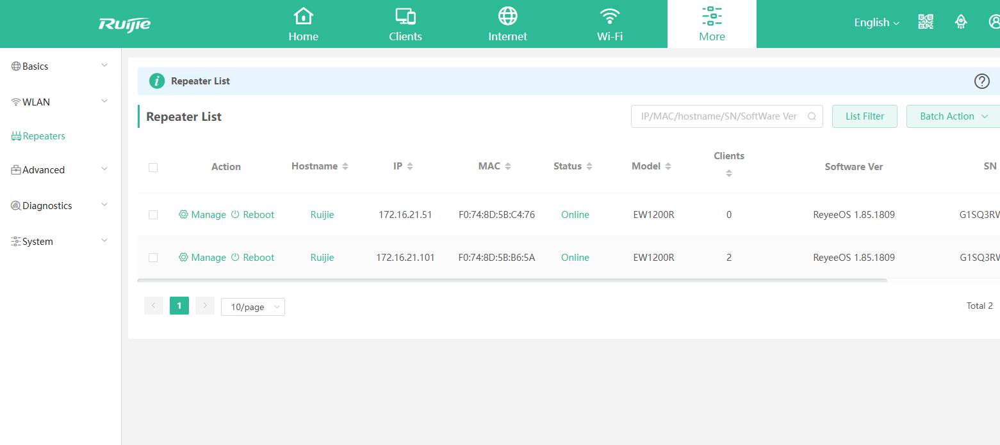
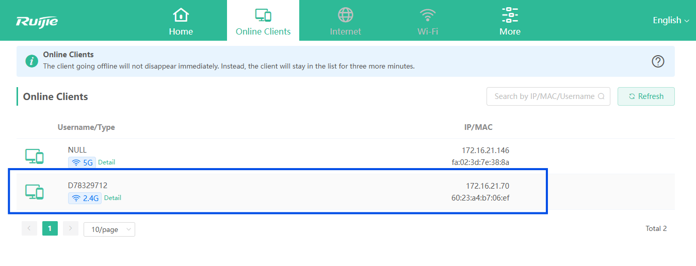
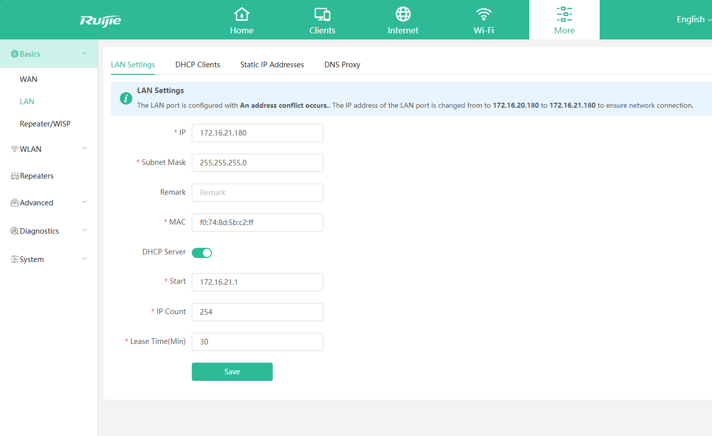

## Overview

This project documents the deployment and testing of a Ruijie EW1200R wireless mesh network environment.

The objective was to simulate a small branch office or remote site deployment where a root router provides Internet connectivity and additional wireless repeaters extend network coverage without requiring Ethernet cabling.

The deployment was fully managed through Ruijie Cloud and included remote device management, mesh synchronization, NAT services, DHCP services, client onboarding and wireless camera connectivity testing.

---

### Objectives

- Deploy a multi-node wireless mesh network using Ruijie EW1200R routers
- Validate automatic mesh pairing functionality
- Test wireless backhaul operation
- Verify DHCP and NAT services
- Test remote cloud management capabilities
- Validate Web Tunnel remote access functionality
- Connect and test wireless IP camera operation through the mesh network

---

### Technologies Used

- Ruijie ER1200R
- ReyeeOS
- Wireless Mesh Networking
- NAT
- DHCP
- Wireless Backhaul
- Ruijie Cloud
- Web Tunnel Remote Management
- Wireless Client Provisioning

---

### Equipment

| Device           | Model                           | 
| --------         | --------------------------------| 
| Root Router      | EW1200R                         | 
| Repeater 1       | EW1200R                         | 
| Repeater 2       | EW1200R                         |
| Access Switch    | RG-ES226GC-P (Existing Station) |
| Wireless Camera	 | EZVIZ Camera CS-CV310           | 

---

### Physical Topology


Figure 1 – EW1200R Wireless Mesh Topology showing one Root Router and two synchronized Mesh Repeaters managed through Ruijie Cloud.

---

### Network Topology

```test
Internet

↓

EW1200R Root Router

WAN: 172.16.20.80

LAN: 172.16.21.180

↓

Wireless Mesh Backhaul

↓

EW1200R Repeater 1

IP: 172.16.21.51

↓

EW1200R Repeater 2

IP: 172.16.21.101

↓

EZVIZ Wireless Camera

IP: 172.16.21.70
```

### Deployment Procedure

#### Step 1 - Root Router Deployment

The first EW1200R was deployed as the root router and connected to the existing CCTV network through VLAN 20.

Connection:

RG-ES226GC-P VLAN 20

↓

EW1200R Root Router WAN Port

WAN Address:

172.16.20.80

The device operated in Router Mode and provided DHCP and NAT services for the wireless mesh network.


Figure 2 – Root EW1200R operating in Router Mode with WAN address 172.16.20.80 connected to the existing CCTV VLAN 20 network.

---

#### Step 2 - Mesh Pairing

Two additional EW1200R units were powered on and joined the mesh network.

The pairing process was completed using the physical Mesh/Sync button on both devices.

No manual wireless bridge or WDS configuration was required.

After synchronization, both repeaters automatically appeared within Ruijie Cloud under the Root Router.

Cloud Status:

Synced

Online


Figure 3 – Ruijie Cloud successfully displaying the Root Router and two synchronized mesh repeaters.

---

#### Step 3 - Wireless Backhaul Validation

The repeaters established wireless backhaul links to the Root Router.

Topology:

Root Router

↓

Repeater 1

↓

Repeater 2

The deployment successfully extended network coverage without requiring Ethernet cabling between devices.



Figure 4 – Repeater status page showing both EW1200R repeaters successfully synchronized with the root router and operating through wireless mesh backhaul.

---

#### Step 4 - Client Connectivitu Testing

An EZVIZ wireless camera was connected to the mesh network.

Assigned Address:

172.16.21.70

Validated:

Validated:

- Wireless client association
- DHCP address assignment
- Mesh backhaul communication
- Cloud management visibility
- Internet connectivity



Figure 5 – EZVIZ wireless camera successfully connected to the mesh network and obtained IP address 172.16.21.70 from the EW1200R DHCP service.

---

#### Step 5 - Web Tunnel Remote Management

Ruijie Cloud successfully provided remote management access to all EW1200R devices.

Verified:

Device monitoring
Configuration management
Status monitoring
Web Tunnel remote access

No port forwarding was required.

---

### Findings

#### Automatic LAN Conflict Detection

An attempt was made to configure the LAN address as:

172.16.20.180

The system automatically changed the LAN address to:

172.16.21.180

Reason:

The WAN interface was already operating on:

172.16.20.0/24

Using the same subnet on both WAN and LAN interfaces would create a routing conflict.

ReyeeOS automatically generated:

172.16.21.0/24

to maintain proper NAT and routing functionality.

This demonstrated built-in Layer 3 conflict detection and automatic network correction features.



Figure 6 – Automatic subnet conflict detection. ReyeeOS changed the LAN subnet from 172.16.20.0/24 to 172.16.21.0/24 to avoid a WAN/LAN addressing conflict.

---

### Key Features Tested

#### Root Router Deployment

WAN:

172.16.20.80

LAN:

172.16.21.180

#### Automatic Mesh Pairing

Using:

Mesh / Sync Button

to onboard additional EW1200R devices.

Wireless Backhaul

Root

↓

Repeater

↓

Repeater

No Ethernet cabling required.

#### Cloud Management

All devices synchronized successfully with Ruijie Cloud.

#### Web Tunnel Remote Access

Verified remote access to all mesh devices through Ruijie Cloud without port forwarding.

#### Client Connectivity

Successfully connected:

EZVIZ Wireless Camera

172.16.21.70

---

### Skills Demonstrated

- Wireless Mesh Architecture
- Wireless Mesh Deployment
- Wireless Repeater Configuration
- DHCP Services
- NAT
- Wireless Backhaul Technologies
- Layer 3 Routing Concepts
- Wireless Client Provisioning
- Cloud-Based Network Management
- Remote Monitoring
- Remote Troubleshooting
- Remote Device Administration
- Network Validation
- Small Branch Network Deployment

---

### Lessons Learned

This project provided practical experience with enterprise-style wireless mesh deployments and demonstrated how Ruijie Cloud can simplfy remote network management.

The deployment also highlighted the importantce of Layer 3 design considerations, particularly WAN and LAN subnet separation when NAT services are enabled.

The automatic subnet conflict detection feature within ReyeeOS provided additional insight into how modern networking platforma protect administrators from common configuration mistakes.

This project also demonstrated how modern wireless mesh solutions can be rapidly deployed and remotely managed through cloud-based platforms without requiring advanced wireless controller infrastructure.
