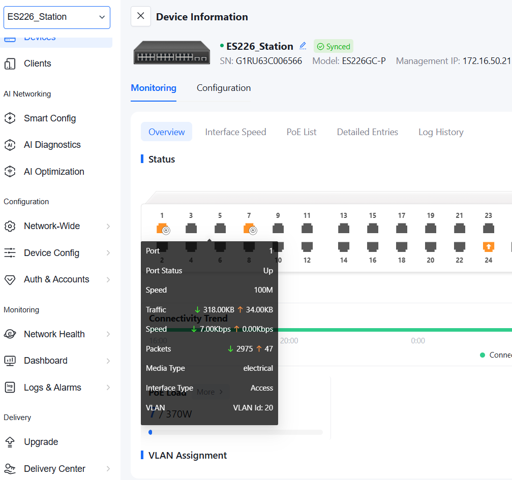
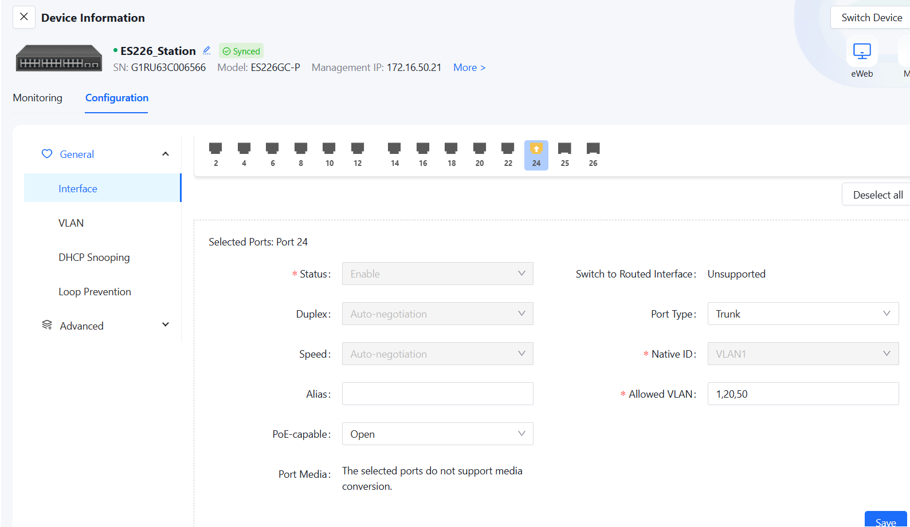

This project documents the deployment of a remote CCTV testing station using a Ruijie ES226 PoE switch connected to a Cisco Catalyst 3560 trunk port.

The objective was to extend the existing VLAN20 CCTV testing environment to a secondary workstation while maintaining management access through VLAN50.

## Network Topology

```text
Cisco Catalyst 3560
Fa0/14 (802.1Q Trunk)
        |
        |
ES226 Port24 (Trunk)
        |
   +----+----+
   |         |
 Port1     Port7
 IPC       IPC
 VLAN20    VLAN20
```

### Initial Problem

After configuring ports 1-10 as VLAN20 access ports:

- IPCs powered up correctly
- Link status showed 100M Full Duplex
- Devices did not appear in SADP
- No DHCP address was obtained

### Investigation

Port1 Connected



Figure 1 - IPC connected successfully to ES226 Port1.


### Access VLAN1


Figure 2 - Uplink port configured as Access VLAN1.

### Findings:

The Cisco uplink was configured as an 802.1Q trunk while the ES226 uplink remained configured as an access port.

This prevented VLAN20 traffic from traversing the uplink.



Figure 3 - ES226 Port24 reconfigured as an 802.1Q trunk.

### Root Cause

Root Cause:

ES226 Port24 was configured as:

Access VLAN1

while Cisco SW1 Fa0/14 was configured as:

Trunk
Allowed VLANs 10,20,50,60

As a result, VLAN20 tagged traffic could not traverse the uplink between the ES226 and Cisco Catalyst switch.

### Resolution

Actions performed:

1. Created VLAN20 (CCTV)
2. Created VLAN50 (Management)
3. Changed ES226 Port24 from Access to Trunk
4. Allowed VLANs 1,20,50
5. Verified cloud connectivity remained operational

Configured Port24 as:

Port Type: Trunk
Native VLAN: 1
Allowed VLANs: 1,20,50


Figure 4 - Final trunk configuration.

### Verification

Verification completed:

- IPC devices appeared in SADP
- IPC devices obtained Layer 2 connectivity
- VLAN20 traffic successfully traversed the trunk link
- VLAN20 connectivity restored
- Cloud management remained online
- Management IP 172.16.50.21 remained reachable

## Skills Demonstrated

- VLAN Configuration
- 802.1Q Trunking
- Layer 2 Switching
- Cisco Catalyst Switching
- Ruijie Cloud Management
- CCTV Infrastructure Deployment
- Root Cause Analysis
- Network Troubleshooting
- Technical Documentation


